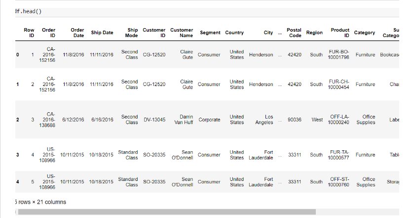
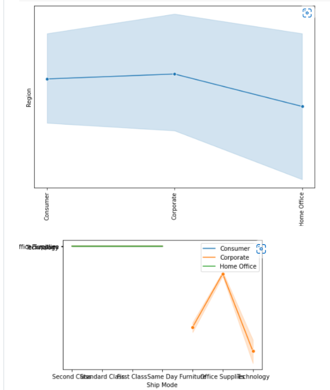
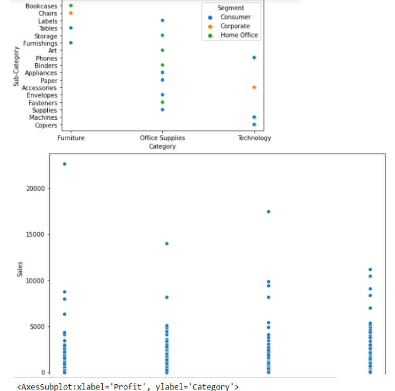
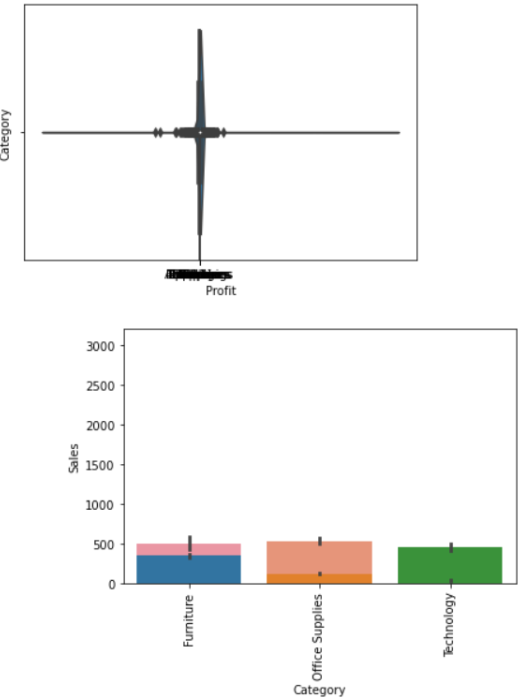
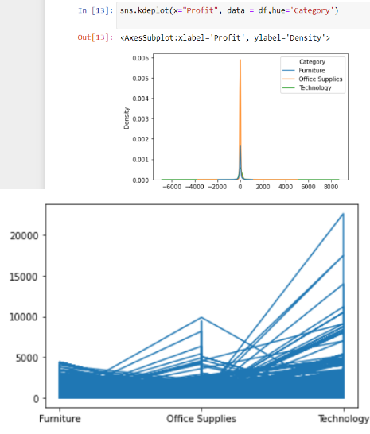
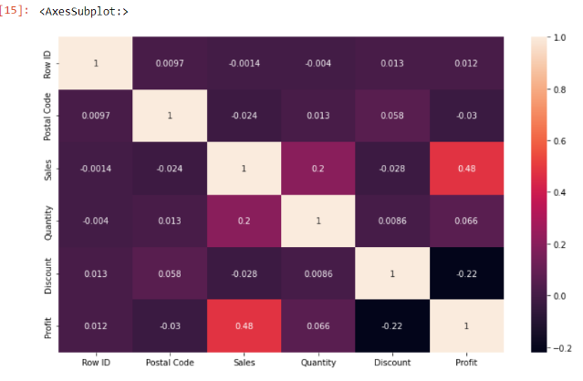
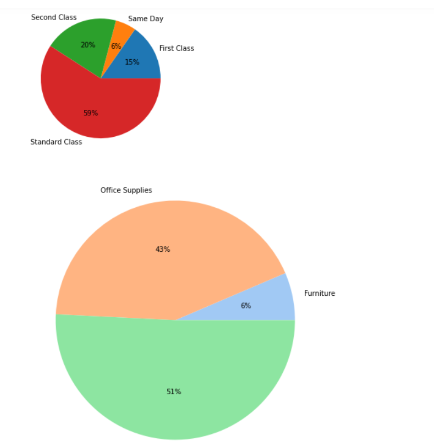
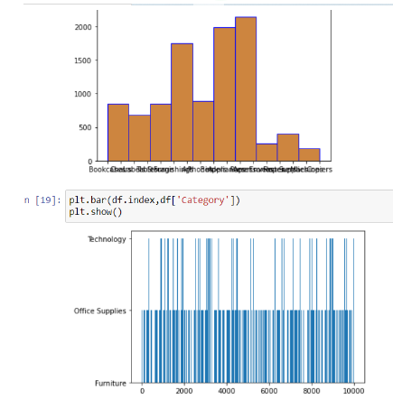
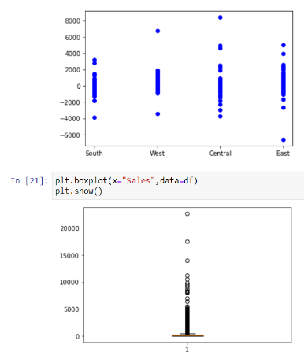

# Ex-08-Data-Visualization-

## AIM
To Perform Data Visualization on a complex dataset and save the data to a file. 

# Explanation
Data visualization is the graphical representation of information and data. By using visual elements like charts, graphs, and maps, data visualization tools provide an accessible way to see and understand trends, outliers, and patterns in data.

# ALGORITHM
### STEP 1
Read the given Data
### STEP 2
Clean the Data Set using Data Cleaning Process
### STEP 3
Apply Feature generation and selection techniques to all the features of the data set
### STEP 4
Apply data visualization techniques to identify the patterns of the data.


# CODE
```
1.Plot

plt.plot(df['Category'], df['Sales']) plt.show()

2.Heatmap

df.corr() plt.subplots(figsize=(12,7)) sns.heatmap(df.corr(),annot=True)

3.Piechart

df1=df.groupby(by=["Ship Mode"]).sum() labels=[] for i in df1.index: labels.append(i) colors=sns.color_palette("bright") plt.pie(df1["Sales"],labels=labels,autopct="%0.0f%%") plt.show()

df3=df.groupby(by=["Category"]).sum() labels=[] for i in df3.index: labels.append(i) plt.figure(figsize=(8,8)) colors = sns.color_palette('pastel') plt.pie(df3["Profit"],colors = colors,labels=labels, autopct = '%0.0f%%') plt.show()

4.Histogram

plt.hist(df["Sub-Category"],facecolor="peru",edgecolor="blue",bins=10) plt.show()

5.Bargraph

plt.bar(df.index,df['Category']) plt.show()

6.Scatterplot

plt.scatter(df["Region"],df["Profit"], c ="blue") plt.show()

7.Boxplot

plt.boxplot(x="Sales",data=df) plt.show()
```

# OUPUT











# Result  

Hence,  Data Visualization is applied on the complex dataset using libraries like Seaborn and Matplotlib successfully and the data is saved to file.